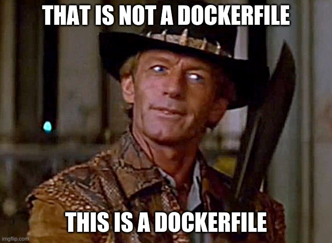

# Docker from Scratch

Builds docker images for a simple Python + Postgres App from scratch.
Made possible by [Linux From Scratch](http://www.linuxfromscratch.org/).

Favours:
- Up to date
- Stable
- Default configuration
- Most common features enabled
- Minimal programs and libraries in each image

Build and run a Nginx, uWSGI + Python, Postgres stack:

    DOCKER_CONTENT_TRUST=1 COMPOSE_DOCKER_CLI_BUILD=1 DOCKER_BUILDKIT=1 docker-compose up -d

You can also cross-compile:

    docker run --rm --privileged multiarch/qemu-user-static --reset -p yes
    docker buildx build --platform linux/arm64 --tag=scratch-nginx --target=nginx .